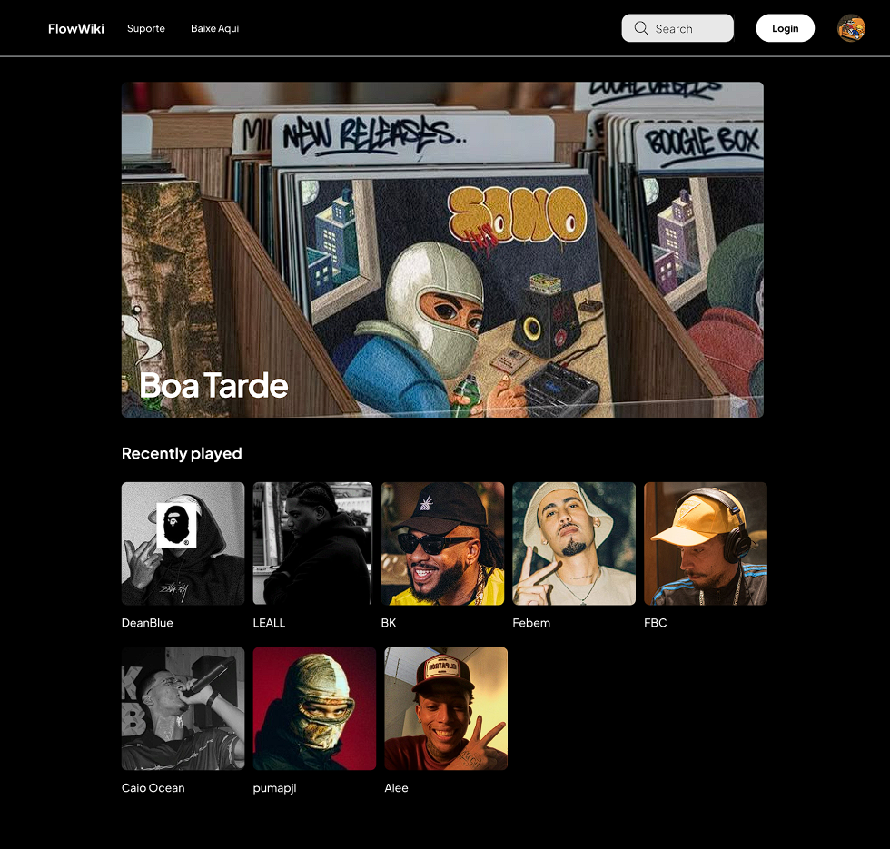

# 🎵 Flow Wiki

Flow Wiki is a modern web platform dedicated to Brazilian hip-hop and boombap culture. This interactive platform showcases artists, their discographies, and offers music downloads and community support options.



## 📋 About the Project

Flow Wiki serves as an encyclopedia for Brazilian hip-hop enthusiasts, providing detailed information about artists in the boombap scene. The platform features a sleek, modern dark-themed interface that highlights artist profiles, music collections, and cultural contributions.

### Key Features

- **Artist Profiles**: Detailed pages for each artist featuring biography, discography, and popular tracks
- **Music Discovery**: Browse and discover related artists and new music
- **Downloads**: Access to downloadable content like album covers and lyrics
- **Community Support**: Options for users to contribute financially to maintain the platform

## 🖥️ Technologies Used

- HTML5
- CSS3
- JavaScript
- Modern Responsive Design

## 🏗️ Project Structure

```
flow-wiki/
├── index.html                # Main homepage
├── assets/
│   ├── css/                  # Styling files
│   │   ├── artist.css        # Artist page styling
│   │   ├── donation.css      # Donation page styling
│   │   ├── download.css      # Download page styling
│   │   ├── home.css          # Homepage styling
│   │   ├── main.css          # Core styling
│   │   ├── normalize.css     # CSS normalization
│   │   └── subscription.css  # Subscription page styling
│   │
│   ├── js/                   # JavaScript files
│   │   ├── app.js
│   │   └── main.js
│   │
│   └── pages/                # HTML pages for different sections
│       ├── Alee.html         # Artist pages
│       ├── BK.html
│       ├── CaioOcean.html
│       ├── DeanBlue.html
│       ├── Djonga.html
│       ├── donation.html     # Support/donation page
│       ├── download.html     # Downloads page
│       ├── subscription.html # Subscription page
│       └── ...               # Other artist pages
│
└── src/
    ├── images/               # Image assets
    │   ├── favicon.png
    │   ├── Alee/             # Artist-specific images
    │   ├── Bk/
    │   ├── CaioOcean/
    │   └── ...
    │
    └── UI/                   # UI design mockups
        ├── ArtistPage.png
        ├── donation.png
        ├── Download.png
        ├── home.png
        └── subscription.png
```

## 🚀 Getting Started

1. Clone the repository:
   ```
   git clone https://github.com/gomesdevs/wiki-boombap.git
   ```

2. Open `index.html` in your browser to view the site locally

3. Navigate through different artist pages and explore features

## 📱 Responsive Design

Flow Wiki is built with a mobile-first approach, ensuring optimal viewing experience across a wide range of devices from desktop computers to mobile phones.

## 🎨 Design Philosophy

The site features a dark theme with a clean, minimalist interface that puts content first. Key design elements include:

- Dark background with high contrast text for readability
- Card-based layout for organized content presentation
- Subtle animations and transitions for enhanced user experience
- Consistent navigation pattern across all pages

## 🤝 Contributing

Contributions are welcome! If you'd like to contribute:

1. Fork the repository
2. Create your feature branch (`git checkout -b feature/amazing-feature`)
3. Commit your changes (`git commit -m 'Add some amazing feature'`)
4. Push to the branch (`git push origin feature/amazing-feature`)
5. Open a Pull Request

## 📄 License

This project is licensed under the MIT License - see the [LICENSE](LICENSE) file for details.

## 👏 Acknowledgments

- All the amazing Brazilian hip-hop artists featured on the platform
- The boombap community for inspiration and support
- Contributors and supporters of the Flow Wiki project

---

Developed with ❤️ for the Brazilian hip-hop community.